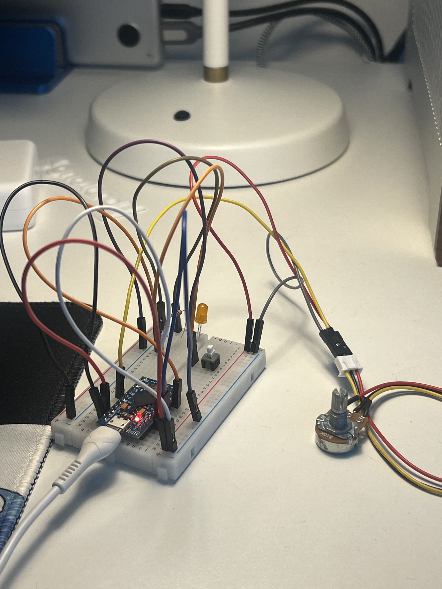

# Arduino Bunny Hopper

A program that allows Arduino to act as a USB keyboard and fires *Space* key presses at a given interval.

## What's bunny hop?

> [Bunny hopping](https://en.wikipedia.org/wiki/Strafing_(video_games)#Bunny_hopping) is an advanced movement method used in some first-person shooter games which relies on exploiting movement mechanics by combining strafing and jumping. \
> *- Wikipedia*

## Requirements

- [Arduino Pro Micro](https://www.sparkfun.com/products/12640) or Leonardo
- Button
- Optional:
  - Potentiometer - to control frequency, see config below.
  - LED + 220Ω Resistor - to indicate keyboard status.

## Configuration

### Pinout

Pinouts configuration is defined in [include/config.h](include/config.h).

Potentiometer can be enabled by defining pin number with `PIN_BHOP_INTERVAL_CTRL`.

> [!IMPORTANT]
> In order for board to start, connect `PIN_KBD_JUMPER` pin to a ground.
> Otherwise, board will boot into recovery mode.

### Testing

Keyboard speed and latency test tool is available here: https://x1unix.github.io/arduino-bunnyhopper/tester/

### Debugging

Some boards can't be reprogrammed while they act as a USB keyboard.\
To address this, firmware comes with a recovery mode.

USB keyboard is disabled in recovery mode, so board can be easily reprogrammed.

To enable recovery mode, disconnect the `PIN_KBD_JUMPER` pin from a ground and reconnect a board.

> [!TIP]
> In recovery mode, status LED immediately turns on after board boots.
